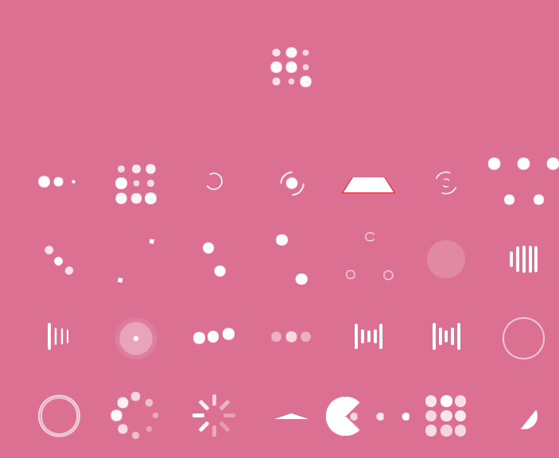

# Angular Loaders.css

[Loaders.css](https://connoratherton.com/loaders) component for Angular X.

## Demo



Click [here](https://ngx-loaders-css-demo.stackblitz.io) to see the live DEMO, or try it out on [stackblitz](https://stackblitz.com/edit/ngx-loaders-css-demo).

## Installation

```bash
npm install ngx-loaders-css loaders.css
or
yarn add ngx-loaders-css loaders.css
```

## Usage

```typescript
// ...
import { NgxLoadersCssModule } from 'ngx-loaders-css';

@NgModule({
  // ...
  imports: [BrowserModule, NgxLoadersCssModule],
})
export class AppModule {}
```

```typescript
// ...
import { Component } from '@angular/core';
import { LoadersCSS } from 'ngx-loaders-css';

@Component({
  selector: 'app-root',
  template: '<loaders-css [loader]="loader" [scale]="3" [bgColor]="bgColor" [color]="color"></loaders-css>',
  styleUrls: ['./app.component.css'],
})
export class AppComponent {
  loader: LoadersCSS = 'pacman';
  bgColor = 'black';
  color = 'rgba(100, 100, 100, 0.5)';
}
```

## Props

| props   | type        | optional | default     | desc                                                         |
| ------- | ----------- | -------- | ----------- | ------------------------------------------------------------ |
| bgColor | string      | true     | transparent | set container background color, all valid css color          |
| color   | string      | true     | #FFFFFF     | set spinner elements color, all valid css color              |
| loader  | `LoaderCSS` | true     | ball-pulse  | import  `LoadersCSS` type to get intellisense and type check |
| scale   | number      | true     | 1           | zoom loader size                                             |

## Known issues

- Prop color only affect to those loaders that design without border color, the default color is generate by Loader.css style.
